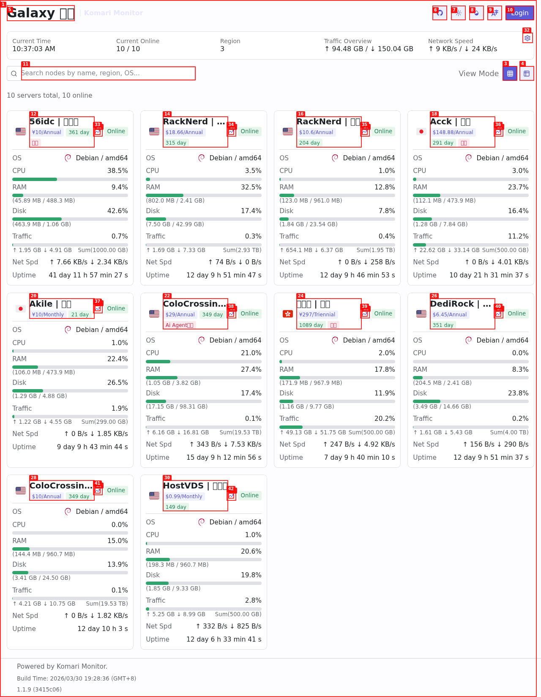
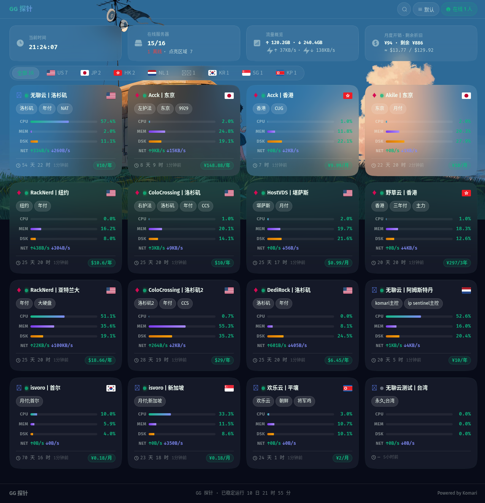
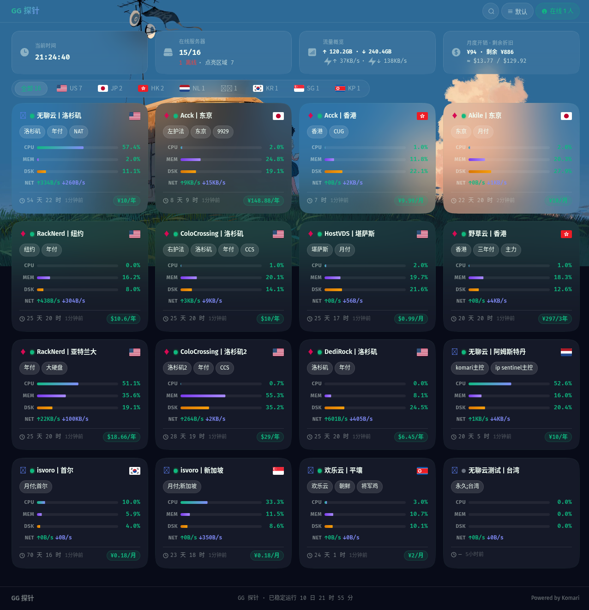

# GalaxyGlass

> 银河玻璃 — Komari 监控面板主题
> 深空蓝黑 · 翠绿点缀 · 毛玻璃特效 · Apple Squircle 圆角



## Screenshots

| 桌面端 | 移动端 |
|--------|--------|
|  |  |

## 特性

- **深空蓝黑毛玻璃 UI** — `#0e152e` 底色 + 翠绿 `#10b981` 点缀，三层背景深度
- **动态视频壁纸** — poster+video 双层过渡，桌面端视频 / 移动端海报
- **响应式卡片网格** — 从单列到四列自适应，移动端搜索栏折叠展开
- **实时 stats 栏** — 在线节点数 / 总流量 + 瞬时速率 / 剩余价值 + 总价值
- **区域筛选** — 滑动 snap 吸附 + 弹簧动画指示器
- **详情页** — 双列系统信息 + 计费芯片 + 3 个实时图表（CPU/内存/网络）
- **Squircle 圆角** — Figma 风格连续曲线 Apple 圆角，匹配 CSS token
- **纯前端** — 无需构建，直接部署

## 主题包结构

```
theme.zip
├── komari-theme.json    # 主题配置
├── preview.png          # 预览图
└── dist/
    └── index.html       # 主页面模板
```

## 安装

### 方法一：Komari 面板上传

1. 下载 Release 中的 [`theme.zip`](https://github.com/newemperor221/galaxy-glass/releases)
2. 在 Komari 管理面板 → 主题 → 上传主题包
3. 选择 `theme.zip` 即可

### 方法二：手动部署

```bash
# 替换服务器上的主题文件
scp dist/index.html root@<server>:/opt/komari/data/theme/GalaxyGlass/dist/index.html

# 或替换默认主题
scp dist/index.html root@<server>:/opt/komari/data/theme/default/dist/index.html
```

### 方法三：从 Release 下载 HTML

直接下载 [`index.html`](https://github.com/newemperor221/galaxy-glass/releases/download/v2.3.0/index.html) 放置到服务器对应目录。

## 数据字段

| 卡片字段 | 来源 | 说明 |
|----------|------|------|
| CPU | `cpu` | 百分比 |
| 内存 | `memory_used / memory_total` | 已用量 / 总量 |
| 磁盘 | `disk_used / disk_total` | 已用量 / 总量 |
| 下行 | `network_in` | 瞬时速率 (B/s) |
| 上行 | `network_out` | 瞬时速率 (B/s) |
| 运行 | `uptime` | 秒数 → 显示天/时 |
| 价格 | `price / billing_cycle` | 含币种和周期 |
| 到期 | `expired_at` | 剩余天数计算 |
| 标签 | `tags` | 自定义标签 |

## 技术栈

- **纯 HTML/CSS/JS** — 无框架依赖
- **Canvas 图表** — DPR 适配，端点圆点 + 渐变填充
- **毛玻璃效果** — `backdrop-filter: blur(80px)`, 多层玻璃系统
- **Squircle 圆角** — `figma-squircle` 算法，SVG clip-path
- **API** — Komari REST API (`/api/nodes`, `/api/recent/{uuid}`)

## 相关项目

- [Komari](https://github.com/komari-monitor/komari) — 服务器监控面板后端

## 许可证

MIT © M78 星云
